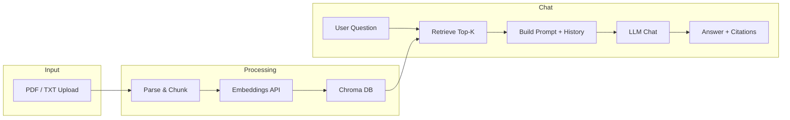

# Talk to Documents (RAG Assistant)

Upload PDFs or text files and ask questions in natural language. The app retrieves the most relevant content and answers **with source citations**, and keeps **conversation memory** across turns.

## Features

- **Streamlit chat UI** with file upload (PDF and `.txt`)
- **Chroma** vector database (persistent, local)
- **OpenAI or Google Gemini** — use either for embeddings and chat (set in `.env`)
- **Source citations** — answers reference document excerpts and page numbers (e.g. [Source 1], [Source 2, Page 3])
- **Conversation memory** — recent chat history is sent to the model so follow-up questions work in context

## Architecture



**Flow:**

1. **Upload** — User uploads a PDF or text file.
2. **Parse & chunk** — Text is extracted (PyPDF for PDFs), split into overlapping chunks, with page numbers kept as metadata.
3. **Embed & store** — Chunks are embedded (OpenAI `text-embedding-ada-002` or Gemini `gemini-embedding-001`) and stored in Chroma (persistent under `./chroma_db`).
4. **Query** — User asks a question; the app embeds the query and retrieves the top-K most similar chunks from Chroma.
5. **Answer** — A system prompt injects the retrieved excerpts and asks the LLM to answer using only that context and to cite sources. Recent conversation history is included for follow-ups.
6. **Response** — The model’s reply is shown in the chat with inline citations.

## Setup

1. **Clone and install**

   ```bash
   cd talk2docs
   python -m venv venv
   source venv/bin/activate   # or: venv\Scripts\activate on Windows
   pip install -r requirements.txt
   ```

2. **API key (choose one)**

   Create a `.env` file **in the same folder as `main.py`**. The app loads `.env` from that directory so it works no matter where you run the command from.

   **Option A — OpenAI**

   ```env
   OPENAI_API_KEY=sk-your-openai-api-key
   ```

   **Option B — Google Gemini**

   ```env
   LLM_PROVIDER=gemini
   GEMINI_API_KEY=your-gemini-api-key
   ```

   Get a Gemini API key at [Google AI Studio](https://aistudio.google.com/apikey). The app also accepts `GOOGLE_API_KEY` instead of `GEMINI_API_KEY`. If you set only `GEMINI_API_KEY` (and no OpenAI key), the app uses Gemini automatically.

3. **Run**

   ```bash
   streamlit run main.py
   ```

   Open the URL shown in the terminal (usually http://localhost:8501).

## Short Demo

1. **Upload** — Use the file uploader to select a PDF or `.txt` file. Wait until you see “Document loaded: **filename**”.
2. **Ask** — Type a question in the chat (e.g. “What are the main conclusions?” or “Summarize page 2”).
3. **Citations** — The answer will reference the document, e.g. “According to the report [Source 1, Page 2], …”.
4. **Follow-ups** — Ask a follow-up (e.g. “And what did it say about costs?”); the model uses conversation memory and the same document context.

## Optional env vars

| Variable                 | Default               | Description                                      |
|--------------------------|-----------------------|--------------------------------------------------|
| `OPENAI_API_KEY`         | —                     | OpenAI API key (when using OpenAI)               |
| `OPEN_API_KEY`           | —                     | Alternative name for OpenAI key                  |
| `OPENAI_EMBEDDING_MODEL` | `text-embedding-ada-002` | OpenAI embedding model                         |
| `OPENAI_CHAT_MODEL`      | `gpt-4o-mini`         | OpenAI chat model                                |
| `GEMINI_API_KEY`         | —                     | Google Gemini API key (when using Gemini)        |
| `GOOGLE_API_KEY`         | —                     | Alternative name for Gemini key                  |
| `GEMINI_EMBEDDING_MODEL` | `gemini-embedding-001`| Gemini embedding model                           |
| `GEMINI_CHAT_MODEL`      | `gemini-1.5-flash`    | Gemini chat model                                |
| `LLM_PROVIDER`           | `openai`              | `openai` or `gemini`                             |
| `CHROMA_PERSIST_DIR`     | `./chroma_db`         | Directory for Chroma persistence                 |

## License

MIT.
